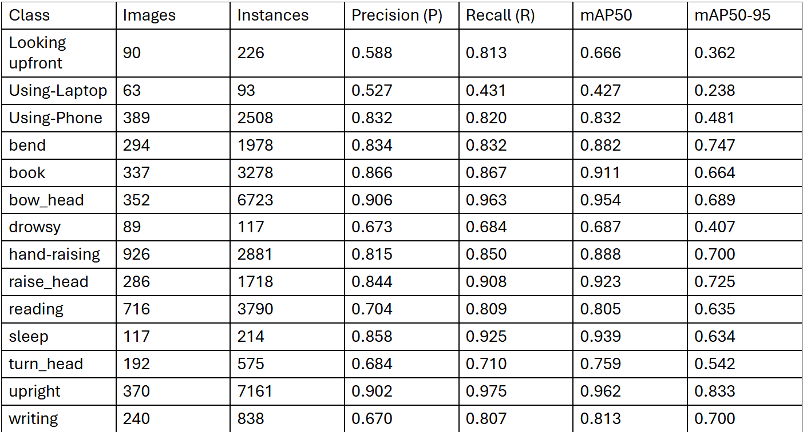
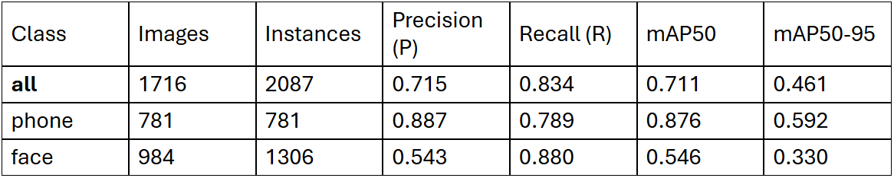

Features:
Behavior Detection: Detect student behaviors (e.g., attentive, distracted) using the YOLO model.
Image Input and Output: Users can upload classroom photos, and the system returns annotated images.
Behavior List: Displays detected behaviors and their confidence scores.
User-Friendly Interface: Built with Gradio, providing an intuitive web-based interface.
GPU Acceleration Support: Automatically utilizes GPU acceleration if CUDA is available.

(Dataset)
roboflow : https://app.roboflow.com/student-action-detection/studentactiondetection-hidrt/1
google drive : https://drive.google.com/file/d/1Heb2N4hRcJH2s9tLdpTzacSj0APbUDdD/view

 (Tech Stack)
Deep Learning Framework: YOLO 11n(You Only Look Once)
User Interface: Gradio
Image Processing: OpenCV
Programming Language: Python, pytorch
Hardware Support: Supports GPU (CUDA) and CPU

<a href="requirements.txt">Requirements</a> 

 (Usage)
Install dependencies: pip install -r requirements.txt
Run the application: python app.py
Open your browser and visit http://127.0.0.1:7860.
Upload a classroom photo and view the detection results.

 (Use Cases)
Educational institutions can use it for classroom behavior analysis to help teachers understand student attentiveness.
Useful for studying student behavior patterns to improve teaching quality.

 (Future Improvements)
Support real-time video stream detection.
Add detection for more behavior categories.
Optimize model performance for higher accuracy.

model_1 20 label : ['Looking down', 'Looking upfront', 'Student', 'Using-Laptop', 'Using-Phone', 'bend', 'book', 'bow_head', 'drinking', 'drowsy', 'eating', 'focused', 'hand-raising', 'phone', 'raise_head', 'reading', 'sleep', 'turn_head', 'upright', 'writing']

model_2 : ['phone','face']
model_1_accuracy
model_2_accuracy

 model_1:detected 1 drowsy
 model_1:detected 7 hand-raising
 model_2:detected 1 face and 1 phone
 model_2:detected 6 face and 1 phone
image label

model_1 best.pt: https://drive.google.com/file/d/1igBMpsj1FFjAECeJf9o_-CpahUIDlD5A/view?usp=sharing
model_2 best.pt: https://drive.google.com/drive/folders/119jLYH9oXgaRMFTNytDCBjg_uenWh_GH
